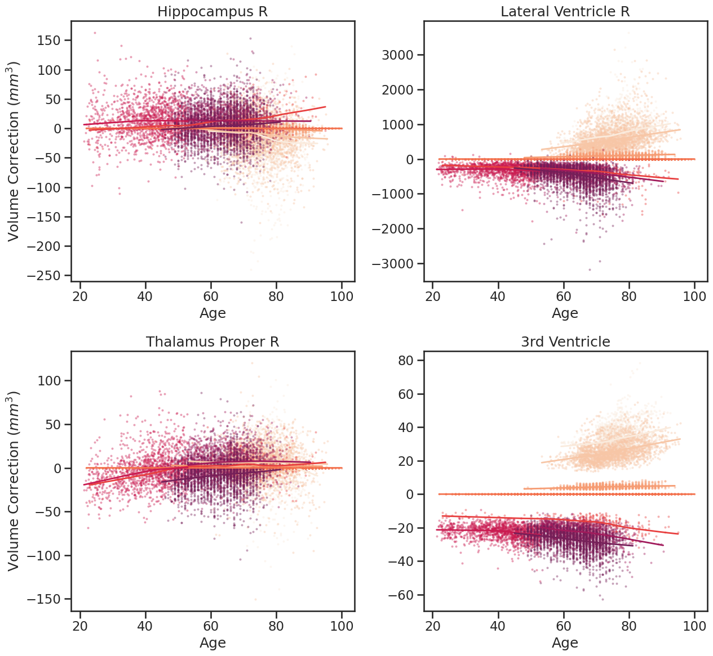

## Flow-SCM: Harmonization with Flow-based Causal Inference

<p align="center">
  
</p>

This is a PyTorch implementation of the [Flow-SCM paper](https://arxiv.org/abs/2106.06845):
```
@article{wang2021harmonization,
  title={Harmonization with Flow-based Causal Inference},
  author={Wang, Rongguang and Chaudhari, Pratik and Davatzikos, Christos},
  journal={arXiv preprint arXiv:2106.06845},
  year={2021}
}
```

This work builds on Pawlowski, Castro, and Glocker's [paper](https://arxiv.org/abs/2006.06485) and the code in this repository is adapted from their [codebase](https://github.com/biomedia-mira/deepscm).

### Enviroment setup

```
pip install -r requirements.txt
```


### Preparation

Prepare data (csv file) to be harmonized in the following structure. Please make sure that the feature variables are located at the end of the columns. We also provide an example (random generated features) dataset in the `datasets` folder.

```
     PTID    Site   Age    Sex  Feature_1  Feature_2       Feature_n
  0  S001  SITE_A  76.5      F    25384.9      263.1          6382.4
  1  S002  SITE_B  80.1      F     2264.1    27402.4           273.5
  2  S003  SITE_A  82.9      M     9472.4     1739.3  ...    27493.2
      ...     ...   ...    ...        ...        ...            ...
  9  S009  SITE_C  82.1      M      264.1     7491.0          3729.1
```

***Note***: other covariates (expect sex and age) can be introduced to the model by modifying `models/nfs.py`.

### Training

There are a few choices for the normalization flows. Set `--flow-type` to `affine` for affine flow; Flow type `autoregressive` combined with `--flow-order` as `linear` stands for linear-Spline flow. Change flow order to `quadratic` gives quadratic-Spline flow.

To train Flow-SCM, run:
```
python train.py --batch-size 64 --test-batch-size 10 --epochs 200 --gpu-id 0 \
  --data-filename [your csv filename in datasets folder] \
  --feature-dim [your features dimension] \
  --flow-type [affine or autoregressive] \
  --flow-order [linear or quadratic]
```

***Note***: training on cpu can be achieved by adding flag `--no-cuda` and removing `device='cuda'` and `.cuda()` in `models/nfs.py`.

***Tips***: 1) increase the training epochs if the log-likelihood keep increasing and not yet saturated at the end; 2) if encounter memory issues when using `autoregressive` flow, reduce the network complexity by changing argument `spline_hidden_dims` in `models/nfs.py` from `None` (default: `[feature-dim * 10, feature-dim * 10]`) to smaller hidden dimensions, for example, `[feature-dim * 5, feature-dim * 5]`.

### Harmonize

With a pre-trained Flow-SCM model, to harmonize a pooled multi-site dataset
, run:
```
python infer.py --batch-size 64 --gpu-id 0 \
  --data-filename [your csv filename in datasets folder] \
  --feature-dim [your features dimension] \
  --flow-type [affine or autoregressive] \
  --flow-order [linear or quadratic] \
  --condition 'do(scanner=0)'
```

***Note***: 1) the `--condition` argument sets the reference site (unchanged) to harmonize towards; change the scanner index to harmonize to different site, for example, `'do(scanner=1)'`; 2) please make sure that `flow-type` and `flow-order` arguments are matched with the pre-trained model; 3) the harmonized data (csv file) will be saved in the `datasets/counterfactuals` folder.


### License

This project is under the CC-BY-NC 4.0 license. See [LICENSE](LICENSE) for details.
